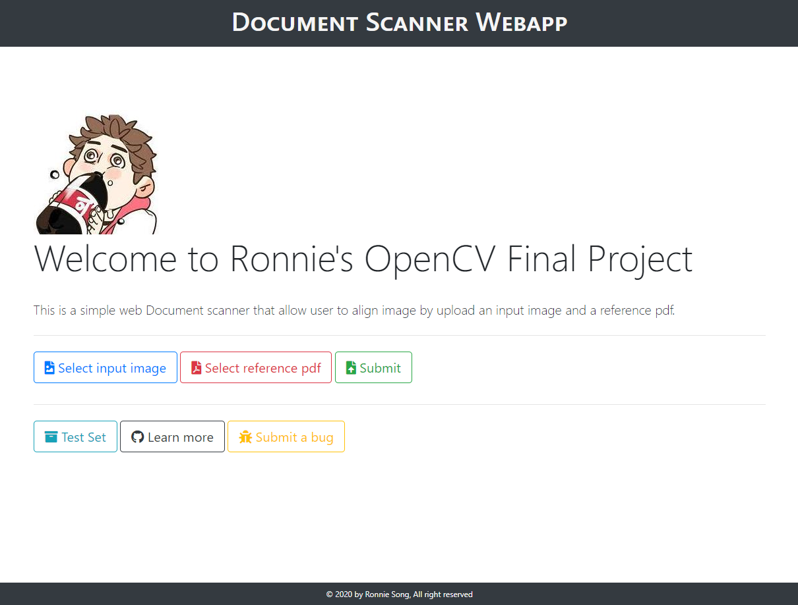

# scanner-webapp
[](https://scanner-webapp.herokuapp.com/)

[](https://github.com/ronniesong0809/scanner-webapp/blob/readme/LICENSE)

Copyright (c) 2020-2021 Ronnie Song

This is a simple web Document scanner that allows the user to align an input image by upload an input image and a reference pdf.

[Demo](https://scanner-webapp.herokuapp.com/)

<a href="https://github.com/ronniesong0809/scanner-webapp/raw/master/static/demo.png">
  
</a>

## Tech Stack and Tools
Python, Flask, gunicorn, Bootstrap Framework, OpenCV, pdf2image, img2pdf

## Installation
**1. Go to the GCP, open Cloud Shell.**
```shell
$ git clone https://github.com/ronniesong0809/scanner-webapp && cd scanner-webapp
$ sudo apt-get update -y
$ sudo apt-get install -y python-pip
$ sudo apt-get install -y poppler-utils
$ virtualenv env
$ source env/bin/activate
$ pip install -r requirements.txt
```

**2. Run the project.**

```shell
$ python app.py
```

**3. Deploy the project.**

```shell
$ gcloud app deploy
```

## Reference
- CS510 CV Project - [Document Scanner](https://github.com/ronniesong0809/scanner)

## License
This program is licensed under the “MIT License”. Please see the file LICENSE in the source distribution of this software for license terms.

scanner-webapp is maintained by ronniesong0809.
This page was generated by GitHub Pages.
